# Getting Started with Python

The purpose of this tutorial is to help you get started installing and using Python. We first provide instructions on how to install and setup **Python** and **Jupyter notebook** on your machine. We then illustrate a few simple commands to help you get started executing Python code from a Web browser via the Jupyter notebook.


## 0. Why Python?

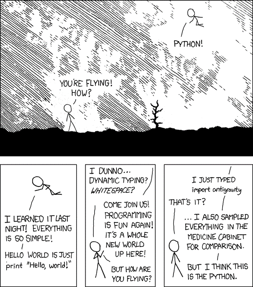

Although there are many programming languages available for implementing data mining algorithms, we choose Python for several reasons. 

1. First, it has emerged as one of the **most popular** programming languages for data science in recent years. 
2. Second, it has **extensive libraries and ecosystems** available to support the collection, preprocessing, mining, and visualization of data, which is beneficial for rapid prototyping of code. 
3. Third, it is **open source**, allowing anyone with access to a computer to download and execute the example code given in this tutorial without the need to install expensive software.


## 1. Installing and Setting Up Python

Although there are many Python installations available, one of the easiest way to install Python on your machine is by using a pre-packaged distribution such as **Anaconda from Continuum Analytics** (http://www.anaconda.com). In this section, we describe the installation procedure for the Anaconda distribution of Python packages.

First, download the Python base installation package from https://www.anaconda.com/download. Execute the downloaded package file and follow the installation steps.

> [Caution] Do not install with administrator privileges!
> 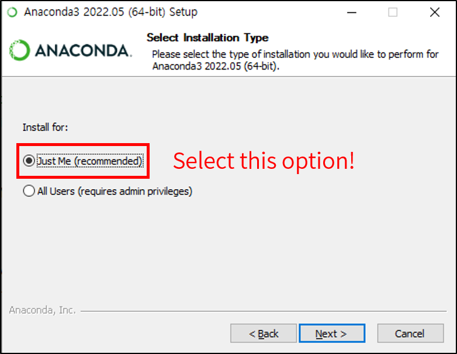

> [FAQ] Q. 설치 경로 설정시 아래와 같은 오류창이 떠요.
>
> 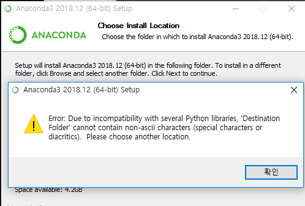
> 
> A. 설치 경로에 한글이 포함되면 안됩니다. 설치 경로에 한글이 포함되어있다면 제거해주세요. 만약 본인이 윈도우즈 운영체제를 사용하고 있으며, 사용자 계정명이 한글인 경우에는, 설치 권한을 `Just Me (recommended)`가 아닌 `All Users (administrator privileges)`로 선택하시고, `C:\Anaconda3` 경로에 설치해보세요.

After installing the base package from the link provided, launch the Anaconda command prompt and the following interface will be displayed:

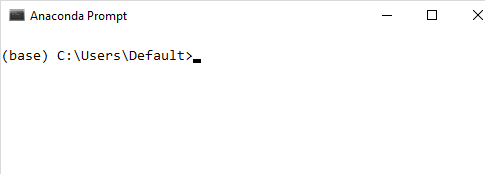


## 2. How to Write and Execute Your Python Program

This section provides some examples on how to write and execute your Python program. 

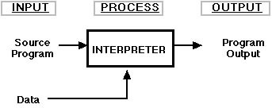

Python is generally considered an interpreted language, which means its program cannot be directly executed by your machine. Instead, it requires another program, called an **interpreter**, to read and execute the Python program. To invoke the interpreter, type `python` on the Anaconda command prompt:

```python
C:\Users\Default> python 
Python 3.6.1 |Anaconda 4.4.0 (64-bit)| (default, May 11 2017, 13:25:24) [MSC v.1900
64 bit (AMD64)] on win32
Type "help", "copyright", "credits" or "license" for more information.
>>>
```

The interpreter is now ready to accept your Python commands. For example, to display the message `Welcome to Data Mining!` on the screen, type:

```python
>>> print('Welcome to Data Mining!')
Welcome to Data Mining!
```

To exit the interpreter, type `quit()` or `exit()` at the interpreter's command prompt. 

You can also write your Python program using a text editor and save it in a file with a `.py` extension. The following example shows a simple Python program for displaying the message `Welcome to Data Mining`. The program is stored in a file named `dm.py`. 

```python
# this is dm.py
print("Welcome to Data Mining!")
```

To execute the program using a Python interpreter on a Windows machine, type the following on Anaconda command prompt:

```python
C:\Users\Default> python dm.py
Welcome to Data Mining!
```

To run the program on a Linux machine:

```python
\users\Default> python dm.py
Welcome to Data Mining!
```

### 2.1. IPython

IPython provides an interactive shell that allows users to execute their Python code in a user-friendly environment. To launch IPython, type `ipython` on the Anaconda command prompt.

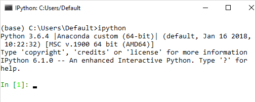

In addition to the different input prompt displayed compared to the standard Python interpreter, the IPython shell is more powerful as it allows you to display graphics, performs tab-completion, object introspection, recall the history of input commands and previous results, etc. For more information, go to <https://ipython.org/ipython-doc/3/interactive/tutorial.html>.

```ipython
In [1]: x = [1,2,3]

In [2]: x
Out[2]: [1 2 3]

In [3]: x.<TAB>
x.append x.count x.insert x.reverse
x.clear x.extend x.pop x.pop
x.copy x.index x.remove

In [3]: x.append(4)

In [4]: y = Out[2]

In [5]: y
Out[5]: [1 2 3 4]

In [6]: y?
Type: list
String form: [1, 2, 3, 4]
Length: 4
Docstring:
list() -> new empty list
list(iterable) -> new list initialized from iterable's items
```

### 2.2. Jupyter Notebook


YOu can also use a Web-based user-friendly environment called Jupyter notebook to write and execute your Python program. To launch the notebook, type the following command on the Anaconda prompt:

```shell
C:\Users\Default> jupyter notebook
```

The preceding command will open the Web browser and display a Web page that shows the directory structure of the default folder set for Jupyter Notebook:

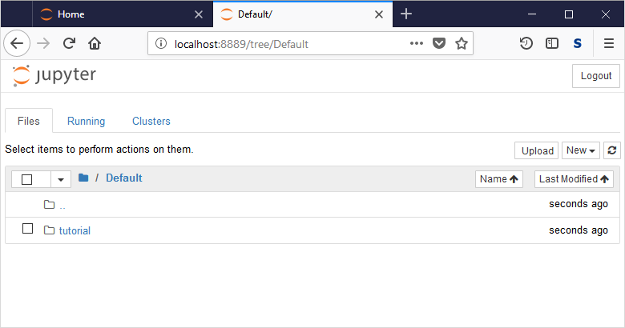

The Jupyter notebook server is running on the Anaconda prompt:

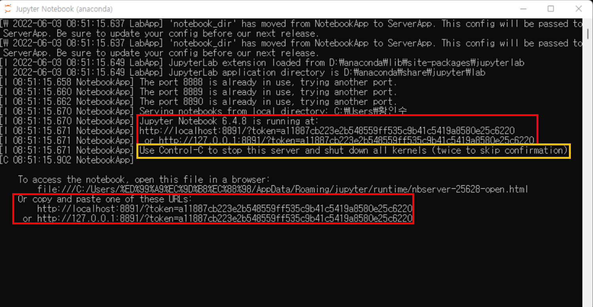

> [FAQ] If you closed the Web browser, you can reopen it using the url information (red box) in terminal. Drag, copy, and paste the url to your web browser.

> [Caution] Be careful for using the `Ctrl+C` command. It will stop the Jupyter notebook server as informed in the prompt(yellow box). If the notebook server is shut down, you cannot access the url.

You can traverse the directory structure to locate the folder that contains the Python code you would like to execute, the data files you would like to load, or the working directory for saving your Python notebook.

To create a new notebook, click on the New button on the top right hand corner of the web page and select sPython 3 notebook.

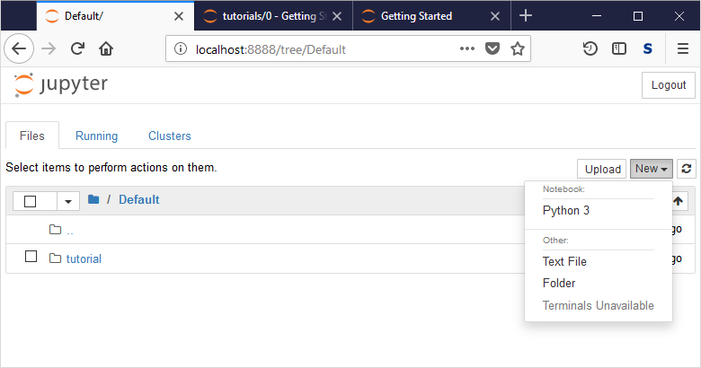

The following web page will be rendered and the notebook is ready to accept your Python commands.

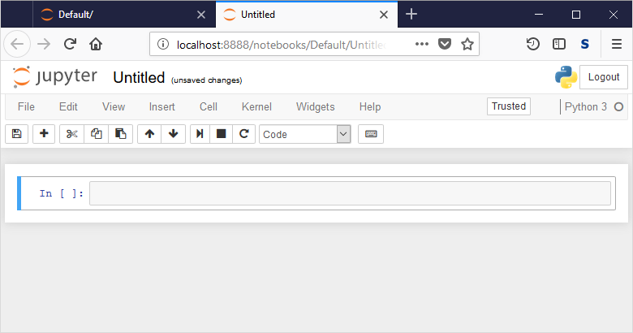

The Python statements are entered in each cell. To execute the Python statements within each cell, press both the `SHIFT` and `ENTER` keys simultaneously. The result will be displayed right below the cell, as shown in the diagram below.

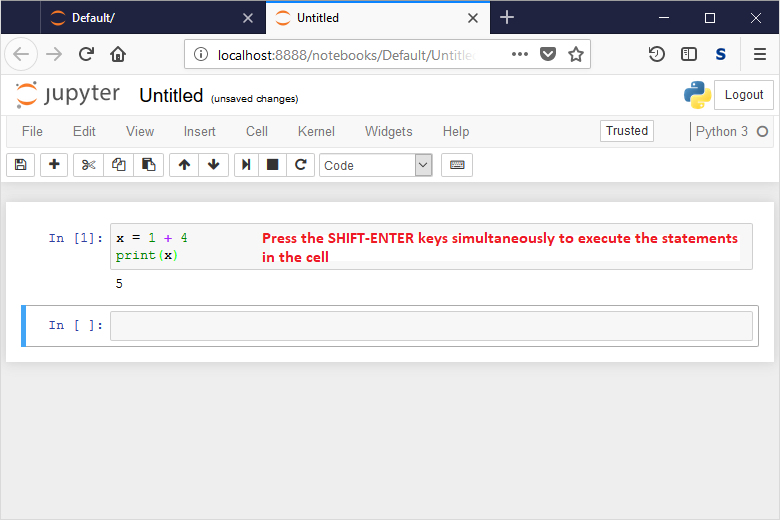

> To see keyboard shortcuts for the Jupyter Notebook, press the `h` key.

By default, the new notebook will be stored in a file named `Untitled.ipynb`. You can rename the file by clicking on File and Rename menu option at the top, as shown in the diagram below.

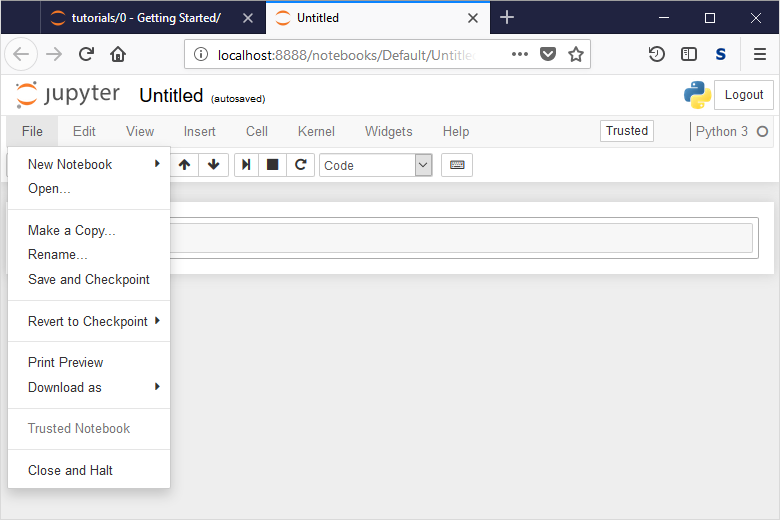

You can save the notebook by clicking on the `File` and `Save and Checkpoint` menu options. The notebook will be stored in a file with a `.ipynb` extension. You can open the notebook and re-run the program and the results you have saved any time. This powerful feature allows you to share your program and results as well as to reproduce the results generated by others. You can also save the notebook into an HTML format by clicking `File` followed by `Download as` options. 

> Note that the IPython notebook is not stored as standard ASCII text files; instead, it is stored in Javascript Object Notation (JSON) file format.

## 3. Summary

This tutorial provides instructions on how to install and setup Python on your machine. It also describes the different ways to execute your Python code, e.g., using the IPython interpreter or a Jupyter notebook. You should familiarize yourself with the various functionalities provided by the Jupyter Notebook as it will be used it in the rest of our tutorials.